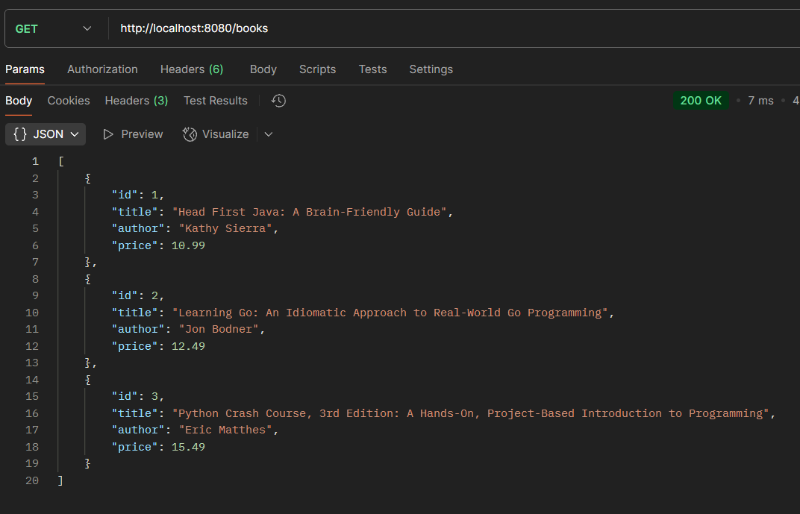
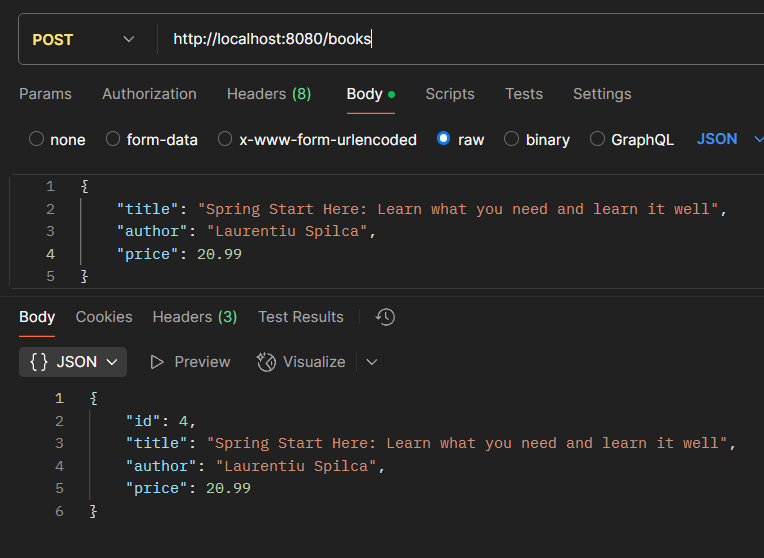
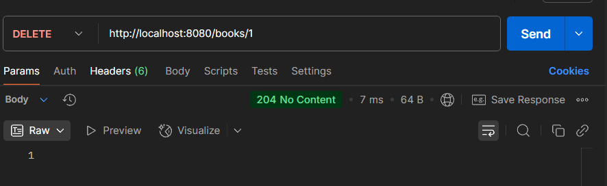

# 📚 BookStoreRest

Simple REST API for managing a mock bookstore system written in Go.

---
## 🚀 Quick Start

### 1. Clone the repository

```bash
git clone https://github.com/daniyarzhalgas/Book-Store-RESTful-Go.git
cd BookStoreRest

```
### API Endpoints

GET	/books	Retrieve all books 

POST	/books	Create a new book

DELETE	/books/{id}	Delete a book by ID


## Initialize Go modules
```
go mod tidy
```
### Run the server
``
go run ./cmd/server
``
### Get all books
GET:http://localhost:8080/books

### Post new book
POST: http://localhost:8080/books

### Delete book 
DELETE: http://localhost:8080/books/1

Server returned 204 No Content it means book id number 1 removed successfully
